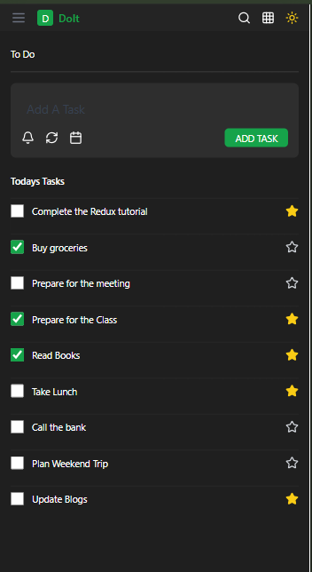
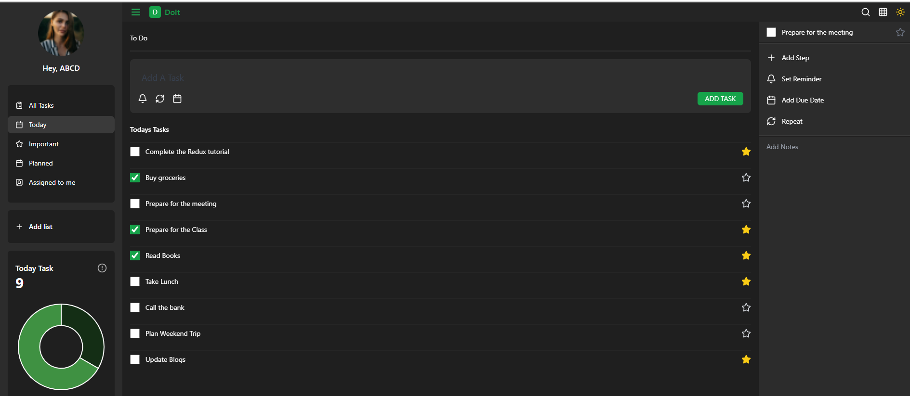
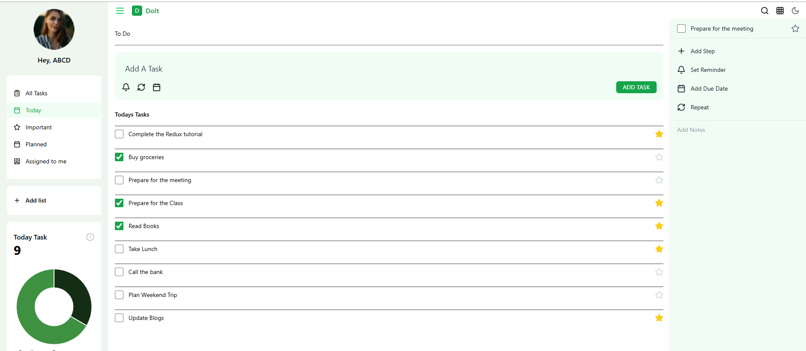

# To-Do List

A simple To-Do List application built with React, Redux, and Vite. This application helps users manage their tasks efficiently with features like task scheduling, reminders, and data visualization.

## Features
- Task management with Redux
- Calendar integration for task scheduling
- Chart visualization using Chart.js
- Time picker for setting reminders
- Smooth animations with React Transition Group
- Styled with Tailwind CSS

## Prerequisites
Ensure you have the following installed:
- [Node.js](https://nodejs.org/) (v16 or later recommended)
- [npm](https://www.npmjs.com/) or [yarn](https://yarnpkg.com/)

## Setup Instructions

### 1. Clone the Repository
```sh
git clone <repository-url>
cd to-do-list
```

### 2. Install Dependencies
Using npm:
```sh
npm install
```
Using yarn:
```sh
yarn install
```

### 3. Run the Development Server
To start the development server, run:
```sh
npm run dev
```
or
```sh
yarn dev
```
The application will be available at `http://localhost:5173/` (or another available port).

### 4. Build for Production
To create a production build, run:
```sh
npm run build
```
or
```sh
yarn build
```

### 5. Preview the Production Build
To preview the built project:
```sh
npm run preview
```
or
```sh
yarn preview
```

### 6. Linting the Code
To check for linting issues:
```sh
npm run lint
```
or
```sh
yarn lint
```

## Technologies Used
- React
- Redux Toolkit
- Vite
- Tailwind CSS
- Chart.js
- React Calendar
- React Time Picker
- React Transition Group







## Contributing
Feel free to fork the repository and submit pull requests for improvements.

## Contact
For any questions or issues, please reach out via rahulbarve132@gmail.com.

